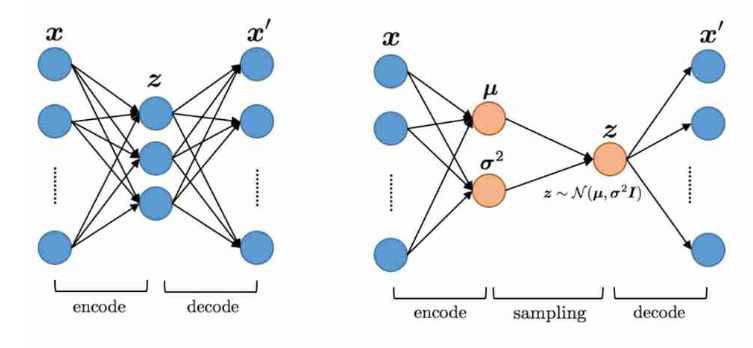

# VAE_generate_character
Implementation of variational auto-encoder to generate MNIST characters.

## VAE vs General Auto-encoder
Using a variational autoencoder, we will not try to make guesses concerning the distribution that’s being followed by the latent vectors.  
We simply tell our network what we want this distribution to look like.  
Goal is not to recover the original data from its encoded version, but to generate new objects of the type the autoencoder has seen before.  


## Note
### Trick in calculating gradient of random variable  
Re-parameterization trick.  
Since we use back prop to train the network, it needs to differentiate the layers. Since in VAE we’re using sampling, when we want to take derivate, we have a problem since our variable is a random variable.  
* If we are given z that is drawn from a distribution q_θ and we want to take derivatives of a function of z with respect to θ, how do we do that?  
z = μ + σ ⊙ ϵ  
where μ is the mean, σ is the std of distribution, ϵ ~ N(0,1)  
We have defined a function that depends on on the parameters deterministically. Now we can calculate gradient.
  
Implementation:  
```

```
